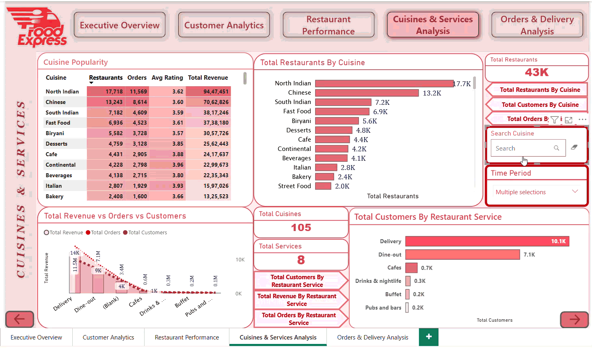
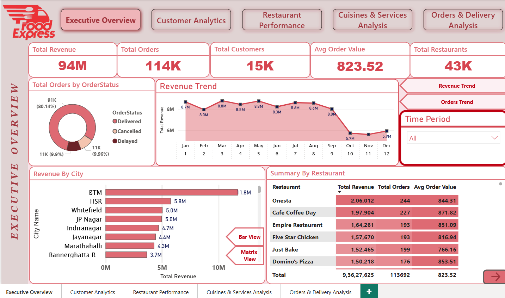
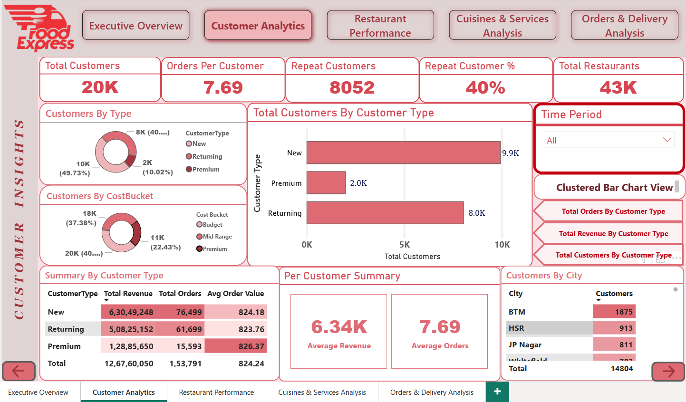
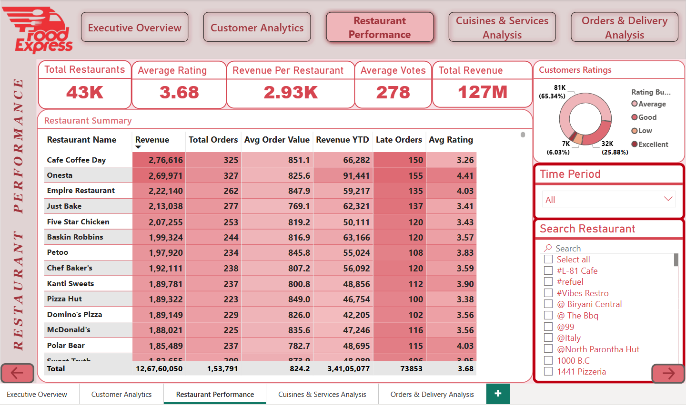
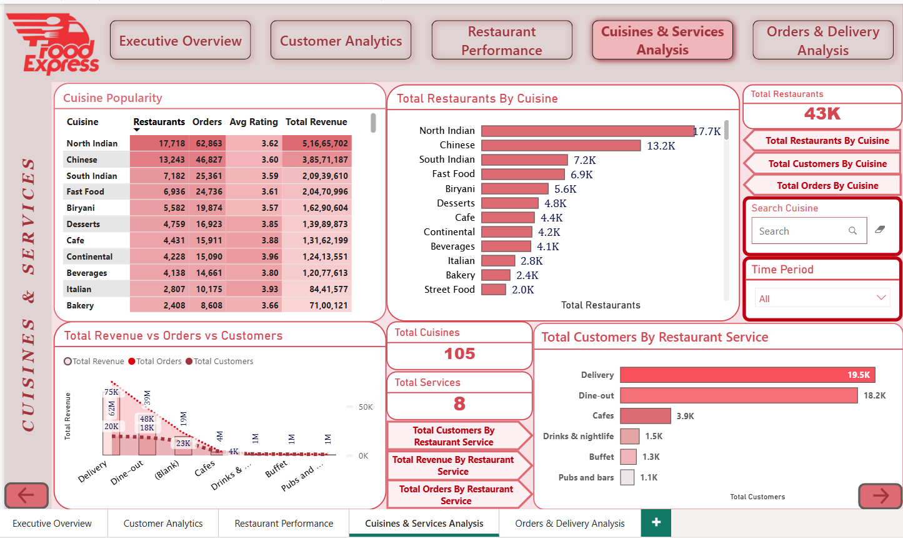
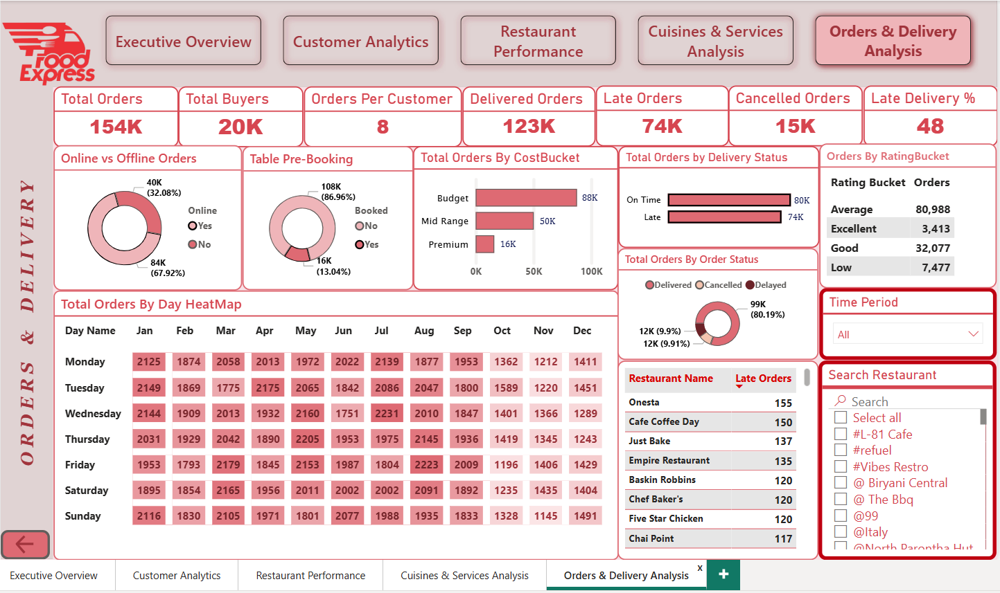

# Food Express — Power BI Business Report (2023–2025)

> A full business intelligence report built on Power BI for a food delivery platform, covering revenue, customers, restaurants, cuisines, and delivery operations.

---

## Table of Contents

1. [Live Report](#1-live-report)
2. [Introduction](#2-introduction)
3. [Problem Statement](#3-problem-statement)
4. [Objective](#4-objective)
5. [Development Process](#5-development-process)
6. [Data Preprocessing and Star Schema Modelling](#6-data-preprocessing-and-star-schema-modelling)
7. [Use Cases, Key Visuals and Insights](#7-use-cases-key-visuals-and-insights)
8. [Pages Description](#8-pages-description)
9. [Requirements](#9-requirements)
10. [Installation](#10-installation)
11. [Conclusion](#11-conclusion)
12. [Developer](#12-developer)

---

## 1. Live Report

This section shows all five pages of the report in action. Each recording below covers one full page of the Power BI report.

### Screen Recordings

| Page | Recording |
|------|-----------|
| Page 1 — Executive Overview |  |
| Page 2 — Customer Analytics |  |
| Page 3 — Restaurant Performance |  |
| Page 4 — Cuisines and Services Analysis |  |
| Page 5 — Orders and Delivery Analysis |  |

---

### Screenshots

<details>
<summary>Click to view screenshots of all 5 pages</summary>

**Page 1 — Executive Overview**


**Page 2 — Customer Analytics**


**Page 3 — Restaurant Performance**


**Page 4 — Cuisines and Services Analysis**


**Page 5 — Orders and Delivery Analysis**


</details>

[Back to Table of Contents](#table-of-contents)

---

## 2. Introduction

This is a business intelligence report built for **Food Express**, a food delivery platform operating across multiple cities in Bangalore. The report covers business data from **2023 to 2025** and is built entirely in **Microsoft Power BI**.

The report brings together data from four core areas:

- Orders placed by customers
- Restaurant listings and their ratings
- Customer profiles and buying behavior
- Delivery timelines and service types

All of this data has been cleaned, modelled, and transformed into five interactive dashboard pages. Each page answers a specific set of business questions using charts, tables, cards, and filters. The report is designed so that any person in the business — whether from operations, marketing, or management — can open it, apply filters, and get clear answers without needing technical knowledge.

The platform recorded over **114,000 orders**, served **15,000+ customers**, and worked with **43,000+ restaurant listings** across the study period, generating a total revenue of **94 million**.

[Back to Table of Contents](#table-of-contents)

---

## 3. Problem Statement

The business needed a single place where it could track performance, understand its customers, and find problem areas quickly. Before this report, data was spread across multiple sources with no central view.

The client came with the following requirements:

1. Show total revenue, total orders, total customers, average order value, and total restaurants all in one overview page with a time filter to change the view by month or year.

2. Show revenue trends across months so the business can see which months are performing well and which are dropping.

3. Show which cities are generating the most revenue so the business can focus marketing and operations in the right areas.

4. Show a breakdown of orders by their status — delivered, cancelled, or delayed — so the operations team can track how many orders are going wrong.

5. Provide a customer analytics page where the business can see how many customers are new, returning, or premium, and what their average order value and total revenue looks like.

6. Show which cities have the most customers and how customers are spread across budget, mid-range, and premium spending buckets.

7. Provide a restaurant performance page where the business can search for any specific restaurant and see its total revenue, total orders, average order value, year-to-date revenue, number of late orders, and average rating — all in one table.

8. Show how restaurants are rated by customers — how many have average, good, excellent, or low ratings — so quality issues can be spotted.

9. Provide a cuisines and services page showing which cuisine types have the most restaurants, most orders, and highest revenue so the business knows what customers are actually ordering.

10. Show which service types — delivery, dine-out, cafes, buffet, drinks, pubs — are being used the most by customers and generating the most revenue.

11. Provide an orders and delivery page showing late delivery percentage, online vs offline orders, table pre-booking rates, and a day-by-day heatmap of orders across every month of the year.

12. Allow all five pages to be filtered by a time period selector so any page can be viewed for a specific window of time.

[Back to Table of Contents](#table-of-contents)

---

## 4. Objective

To analyze the end-to-end performance of the Food Express platform — covering revenue trends, customer behavior, restaurant quality, cuisine demand, and delivery operations — and present clear, data-driven insights that help the business identify what is working, what is not, and where action is needed to improve customer experience, reduce delivery failures, and grow revenue.

[Back to Table of Contents](#table-of-contents)

---

## 5. Development Process

The report was built in four phases, from raw data all the way to the final published dashboard.

**Phase 1 — Data Collection and Understanding**

The raw data came in multiple tables covering restaurants, orders, customers, and dates. Each table had its own quality issues including wrong data types, random strings in numeric columns, duplicate values, and review text mixed in with actual data fields.

**Phase 2 — Data Preprocessing in Power Query**

All tables were loaded into Power Query inside Power BI. Column-by-column cleaning was done — changing data types, removing bad strings, creating conditional columns to replace invalid values with nulls, extracting primary cuisine from comma-separated lists, and splitting cuisine lists into rows for analysis. Full details are in Section 6.

**Phase 3 — Data Modelling**

After cleaning, a Star Schema was built. A central fact table (Orders) was connected to dimension tables for Restaurants, Customers, and Dates. Relationships were defined with correct cardinality and filter directions. A separate Cuisine Analysis Table was created by referencing the Restaurant table and splitting cuisines into individual rows, then linked back by Restaurant ID with bidirectional filtering.

**Phase 4 — Calculated Columns and DAX Measures**

After loading the data, calculated columns were added using DAX to create buckets like Cost Bucket, Rating Bucket, and Delivery Status. Cleaning columns for city names and restaurant names were also done in DAX for large tables where Power Query changes were not practical. Over a dozen DAX measures were written to calculate metrics like Repeat Customer %, Revenue YTD, Late Delivery %, Orders Per Customer, and Revenue Per Restaurant.

**Phase 5 — Report Design and Publishing**

Five report pages were built in Power BI Desktop with a consistent red and white theme matching the Food Express brand. Slicers, navigation buttons, and toggle views were added for interactivity. The final report was exported as a PDF and also saved as a `.pbix` file.

[Back to Table of Contents](#table-of-contents)

---

## 6. Data Preprocessing and Star Schema Modelling

### Data Cleaning Steps (Power Query)

| Step | Column / Table | Issue Found | Fix Applied |
|------|---------------|-------------|-------------|
| 1 | Date columns in 3 tables | Wrong data type (text instead of date) | Changed data type to Date |
| 2 | `online_order` — Restaurants | 33 out of 1000 rows had random strings instead of Yes/No | Created conditional column: Yes → Yes, No → No, else Null |
| 3 | `book_table` — Restaurants | Same issue — 33 random strings out of 1000 | Created conditional column: Yes → Yes, No → No, else Null |
| 4 | `rate` — Restaurants | 80 rows had strings, 920 had values like `4.0/5` | Extracted text before `/`, changed type to Decimal, replaced errors with Null |
| 5 | `votes` — Restaurants | Many rows had random strings | Changed type to Decimal, replaced errors (strings) with Null |
| 6 | Column names | Several columns had unclear or messy names | Renamed: `listed_in(city)` → `Citygroup`, `listed_in(type)` → `Service_Type`, `Costfortwopeople` → `CostForTwo` |
| 7 | `CostForTwo` — Restaurants | 33 rows had strings instead of numbers | Changed type to Decimal, replaced string errors with Null |
| 8 | `cuisine` — Restaurants | Values were comma-separated lists like `North Indian, Chinese, Mughlai` | Extracted text before first comma to create `PrimaryCuisine` column |
| 9 | `PrimaryCuisine` — Restaurants | 40–50 rows had review text (containing words like "rated", "Rated", "RATED") | Created conditional column: if contains "rated" → Null, else keep value |
| 10 | `online_booking` — Restaurants | Random invalid values mixed in | Conditional column used; blanks removed using Merge Queries with inner join to maintain referential integrity |
| 11 | Cuisine Analysis Table | Cuisines column had comma-separated values creating double-counting in revenue | Referenced main table, split cuisines by comma into rows, divided revenue per cuisine count to fix double-counting |
| 12 | `City` — Customers (20,000 rows) | Hundreds of rows had full review paragraphs in the city field | Handled via Calculated Column in DAX (see below) |
| 13 | `name` — Restaurants | Some restaurant names were review strings | Handled via Calculated Column in DAX (see below) |

> **Important Note on Filters vs Conditional Columns:** Filters in Power Query remove entire rows. Conditional columns replace bad values with Null while keeping the row. Since most bad columns are not primary keys, the row must be kept. Always use conditional columns during cleaning.

---

### Calculated Columns (DAX)

These were created after loading data, for large tables where Power Query cleaning was not practical.

**FilterCity — Customers Table**

The city column in the 20,000-row customer table had rows with long review paragraphs. A DAX column was created to blank out any value that had more than 30 characters, more than 4 words, or contained the word "RATED".

```dax
FilterCity = 
VAR CurrentValue = Customers[City]
VAR TotalCharacters = LEN(CurrentValue)
VAR TotalWords = LEN(CurrentValue) - LEN(SUBSTITUTE(CurrentValue, " ", "")) + 1
VAR IsTooLong = TotalCharacters > 30
VAR TooManyWords = TotalWords > 4
VAR IsReviewText = CONTAINSSTRING(CurrentValue, "RATED")
RETURN
IF(TooManyWords || IsTooLong || IsReviewText, BLANK(), CurrentValue)
```

**Cost Bucket — Restaurants Table**

```dax
Cost Bucket = 
IF([CostForTwo] < 500, "Budget",
    IF([CostForTwo] < 1000, "Mid Range", "Premium"))
```

**Rating Bucket — Restaurants Table**

```dax
Rating Bucket = 
SWITCH(TRUE(),
    Restaurants[rate] == BLANK(), BLANK(),
    Restaurants[rate] >= 4.5, "Excellent",
    Restaurants[rate] >= 4.0, "Good",
    Restaurants[rate] >= 3.0, "Average",
    "Low")
```

**Delivery Status — Orders Table**

```dax
Delivery Status = IF(Orders[DeliveryTimeMins] > 45, "Late", "On Time")
```

**Restaurant Name Filtered — Restaurants Table**

```dax
Restaurant Name Filtered = 
VAR RawName = TRIM(Restaurants[name])
VAR IsRated = CONTAINSSTRING(RawName, "rated")
VAR CharCount = LEN(RawName)
VAR WordCount = CharCount - LEN(SUBSTITUTE(RawName, " ", "")) + 1
RETURN
SWITCH(TRUE(),
    IsRated, BLANK(),
    WordCount > 3, BLANK(),
    CharCount > 30, BLANK(),
    RawName)
```

**Service Type Cleaned — Restaurants Table**

```dax
Service_Type_Cleaned = 
IF(
    Restaurants[ServiceType] IN {
        "Deserts", "Dine-out", "Delivery",
        "Cafes", "Buffet", "Drinks & nightlife", "Pubs and bars"
    },
    Restaurants[ServiceType],
    BLANK()
)
```

---

### Star Schema Modelling

The final data model follows a Star Schema where the Orders table sits in the center as the Fact Table, and all other tables are Dimension Tables connected to it.

```
                    [ Date Table ]
                          |
                          | (1 → Many)
                          |
[ Customer Table ] ——— [ Orders Table ] ——— [ Restaurant Table ]
     (1 → Many)    (Fact Table - Center)       (1 → Many)
                                                      |
                                         [ Cuisine Analysis Table ]
                                              (Many, Both directions)
```

**Relationship Details:**

| Relationship | Key Column | Cardinality | Filter Direction | Logic |
|---|---|---|---|---|
| Restaurants → Orders | Restaurant_ID | One-to-Many | Restaurant to Orders | One restaurant has many orders |
| Customers → Orders | Customer_ID | One-to-Many | Customer to Orders | One customer has many orders |
| Date → Orders | OrderDate = Date | One-to-Many | Date to Orders | One date has many orders |
| Restaurants → Cuisine Analysis | Restaurant_ID | One-to-Many | Both | Allows slicers to work on cuisine table |

> **Filter Direction Logic:** The arrow goes from the table with unique values (dimension) toward the table with repeated values (fact). If the arrow is reversed, filters break and totals aggregate across all rows instead of filtered ones.

[Back to Table of Contents](#table-of-contents)

---

## 7. Use Cases, Key Visuals and Insights

This section covers what each page was built to answer and what the numbers actually show.

### Use Case 1 — Business Health Check (Executive Overview)

**Who uses it:** Managers and executives who need a quick top-level view every morning.

**What it answers:** How much revenue did we make? How many orders came in? Are we growing or dropping?

**Key Insights from the Data:**

- Total revenue across the period was **94 million** from **114,000 orders** placed by **15,000 customers**.
- The average order value was steady at **823.52**, suggesting consistent pricing across the platform.
- Revenue was highest in **January (8.7M), March (8.8M), May (8.8M), and July (8.8M)** — alternating peaks suggest seasonal cycles.
- Revenue dropped sharply in **October (5.7M) and November (5.9M)**, which could signal a seasonal dip or data issue worth investigating.
- **80.14% of all orders were delivered successfully**. About 10% were cancelled and 10% were delayed — the cancellation and delay rates are high enough to need attention.
- **BTM** was the top revenue-generating city at **11.8M**, nearly double the second-ranked city HSR at **5.8M**.
- **Onesta** was the top restaurant by total orders (244) with an average order value of **844.31**.

---

### Use Case 2 — Customer Loyalty and Segmentation (Customer Analytics)

**Who uses it:** Marketing teams planning campaigns and loyalty programs.

**What it answers:** Who are our customers? Are they coming back? What are they spending?

**Key Insights from the Data:**

- Of **20,000 total customers**, only **40% (8,052)** were repeat customers — meaning 6 out of 10 customers ordered only once. This is a major retention gap.
- **Premium customers** made up just **10%** of the base (2,000 customers) but had the highest average order value at **826.37**.
- **New customers** were the largest group at **9,900 (49.73%)** and contributed **62.9M in revenue** across **76,499 orders**.
- Average orders per customer was **7.69** and average revenue per customer was **6,340**.
- **BTM** had the most customers at **1,875**, followed by HSR at **913**.
- **40% of customers fell in the Budget cost bucket**, ordering from restaurants priced under 500 for two. Only 22% were in the Premium bucket.

---

### Use Case 3 — Restaurant Quality and Revenue (Restaurant Performance)

**Who uses it:** Partnerships and supply teams evaluating restaurant health.

**What it answers:** Which restaurants are doing well? Which ones have quality or delivery problems?

**Key Insights from the Data:**

- The platform had **43,000 restaurant listings** with an average rating of **3.68 out of 5** — which sits in the Average bucket, meaning overall quality on the platform is moderate.
- **65.34% of all customer ratings** were in the Average category (3.0–3.9). Only **6.03%** were Excellent (4.5+), which shows there is clear room to push restaurants to improve quality.
- **Onesta** had the highest average rating at **4.41** and was one of the top revenue earners at **2,69,971**.
- **Cafe Coffee Day** had the highest revenue overall at **2,76,616** despite a low average rating of **3.26**, meaning volume is driving its numbers, not quality.
- **Late orders were a major problem** — Onesta alone had **155 late orders** and Cafe Coffee Day had **150**. The top revenue restaurants are also the top late delivery restaurants.
- Revenue per restaurant across the full platform was just **2.93K** — very low, suggesting a long tail of low-performing restaurants.

---

### Use Case 4 — Cuisine Demand and Service Type Analysis (Cuisines and Services)

**Who uses it:** Product and operations teams deciding which cuisine types and service models to promote.

**What it answers:** What do customers actually want to eat? Which service type brings in the most business?

**Key Insights from the Data:**

- The platform offers **105 cuisine types** across **8 service types**.
- **North Indian** was the dominant cuisine with **17,718 restaurants**, **62,863 orders**, and **5.16 crore (51.6M) in revenue**.
- **Chinese** was second with **13,243 restaurants** and **46,827 orders**.
- **Continental** had a notably higher average rating of **3.96** and **Italian** was at **3.93**, suggesting niche cuisines maintain better quality.
- **Delivery** was the top service type with **19,500 customers** and **62M in revenue** — far ahead of all other service types.
- **Dine-out** was second at **18,200 customers** and **39M in revenue**.
- Together, Delivery and Dine-out accounted for the vast majority of business. All other service types (Cafes, Buffet, Drinks, Pubs) were significantly smaller.

---

### Use Case 5 — Operational Efficiency (Orders and Delivery Analysis)

**Who uses it:** Logistics and operations teams managing delivery performance.

**What it answers:** Are we delivering on time? When are peak order days? How many people book online vs offline?

**Key Insights from the Data:**

- Out of **154,000 total orders**, **123,000 were delivered**, **15,000 were cancelled**, and a large number were delayed.
- The **late delivery rate was 48%** — nearly half of all orders were late (over 45 minutes). This is a critical operational problem.
- **67.92% of orders were placed online** and 32.08% were offline.
- **86.96% of orders had no table pre-booking** — only 13% used the table booking feature, suggesting it is underutilized or not well known.
- The daily heatmap shows orders were fairly consistent across all days of the week throughout most months, with visible drops in **October and November** on every day of the week.
- **Budget restaurants** received the most orders at **88,000**, while Premium restaurants had only **16,000 orders**.
- Orders rated in the **Average bucket** dominated with **80,988 orders**, confirming that most customer experiences are average, not exceptional.

[Back to Table of Contents](#table-of-contents)

---

## 8. Pages Description

Click on any page name below to expand its full description with all visuals and insights.

---

<details>
<summary><strong>Page 1 — Executive Overview</strong></summary>


This page is the first thing anyone opens. It gives a full top-level picture of how the business is doing — revenue, orders, customers, and which cities and restaurants are leading.

| Visual | Type | What It Shows |
|--------|------|---------------|
| Total Revenue | Display Card | Overall revenue is 94M across the full time period |
| Total Orders | Display Card | 114,000 orders placed in total |
| Total Customers | Display Card | 15,000 unique customers served |
| Avg Order Value | Display Card | Average of 823.52 per order across all restaurants |
| Total Restaurants | Display Card | 43,000 restaurant listings on the platform |
| Revenue Trend | Line Chart | Month-by-month revenue from Jan to Dec — peaks in Jan, Mar, May, Jul; drops in Oct–Nov |
| Total Orders by Order Status | Donut Chart | 80.14% delivered (91K), 9.9% cancelled (11K), 9.96% delayed (11K) |
| Revenue By City | Horizontal Bar Chart | BTM leads at 11.8M, followed by HSR 5.8M, Whitefield and JP Nagar at 5M each |
| Summary By Restaurant | Matrix Table | Shows each restaurant's Total Revenue, Total Orders, and Avg Order Value — Onesta leads with 244 orders and 844.31 avg order value |
| Time Period Slicer | Dropdown Filter | Filters all visuals on the page by selected time window |
| Revenue Trend / Orders Trend Toggle | Buttons | Switches the line chart between revenue view and orders view |
| Bar View / Matrix View Toggle | Buttons | Switches the Revenue By City visual between bar chart and a data matrix |

</details>

---

<details>
<summary><strong>Page 2 — Customer Analytics</strong></summary>


This page focuses entirely on who the customers are — how they are categorized, how much they spend, how often they return, and where they are located.

| Visual | Type | What It Shows |
|--------|------|---------------|
| Total Customers | Display Card | 20,000 total customers on the platform |
| Orders Per Customer | Display Card | Each customer placed an average of 7.69 orders |
| Repeat Customers | Display Card | 8,052 customers ordered more than once |
| Repeat Customer % | Display Card | 40% of all customers are repeat buyers |
| Total Restaurants | Display Card | 43,000 restaurant listings (platform-wide reference) |
| Customers By Type | Donut Chart | New: 10K (49.73%), Returning: 8K (40%), Premium: 2K (10.02%) |
| Customers By Cost Bucket | Donut Chart | Budget: 20K (40%), Mid Range: 18K (37.38%), Premium: 11K (22.43%) |
| Total Customers By Customer Type | Horizontal Bar Chart | Visual comparison — New at 9.9K, Returning at 8.0K, Premium at 2.0K |
| Summary By Customer Type | Table | New customers: 76,499 orders, 6.3 crore revenue, 824.18 avg order value; Returning: 61,699 orders, 5.08 crore; Premium: 15,593 orders, 1.28 crore |
| Per Customer Summary | KPI Cards | Average Revenue per customer: 6.34K; Average Orders per customer: 7.69 |
| Customers By City | Table | BTM: 1875 customers — highest city; HSR: 913; JP Nagar: 811; Whitefield: 783; Total shown: 14,804 |
| Time Period Slicer | Dropdown Filter | Filters all visuals on the page by selected time window |
| Toggle Buttons | View Switchers | Switch chart view between Total Orders, Total Revenue, and Total Customers by Customer Type |

</details>

---

<details>
<summary><strong>Page 3 — Restaurant Performance</strong></summary>


This page is built for the team that works directly with restaurants. It helps identify top performers, quality issues, and delivery problems — and allows searching for any specific restaurant.

| Visual | Type | What It Shows |
|--------|------|---------------|
| Total Restaurants | Display Card | 43,000 restaurant listings in total |
| Average Rating | Display Card | Platform-wide average rating is 3.68 — sits in the Average bucket |
| Revenue Per Restaurant | Display Card | Average revenue generated per restaurant listing is just 2.93K |
| Average Votes | Display Card | Each restaurant has received an average of 278 customer votes |
| Total Revenue | Display Card | Total revenue across all restaurants is 127M |
| Customers Ratings | Donut Chart | Average: 81K (65.34%), Good: 32K (25.88%), Excellent: 7K (6.03%), Low ratings visible but small percentage |
| Restaurant Summary | Detailed Table | For each restaurant: Revenue, Total Orders, Avg Order Value, Revenue YTD, Late Orders, Avg Rating — sorted by revenue descending |
| Search Restaurant | Slicer / Search Box | Type any restaurant name to filter the table and all visuals on the page to that restaurant only |
| Time Period Slicer | Dropdown Filter | Filters all visuals on the page by selected time window |

**Top Restaurants by Revenue (from table):**

| Restaurant | Revenue | Orders | Avg Order Value | Late Orders | Avg Rating |
|---|---|---|---|---|---|
| Cafe Coffee Day | 2,76,616 | 325 | 851.1 | 150 | 3.26 |
| Onesta | 2,69,971 | 327 | 825.6 | 155 | 4.41 |
| Empire Restaurant | 2,22,140 | 262 | 847.9 | 135 | 4.03 |
| Just Bake | 2,13,038 | 277 | 769.1 | 137 | 3.41 |
| Five Star Chicken | 2,07,255 | 253 | 819.2 | 120 | 3.43 |

</details>

---

<details>
<summary><strong>Page 4 — Cuisines and Services Analysis</strong></summary>


This page shows what customers are ordering in terms of food type and how they are using the platform — delivery, dine-out, cafes, and other service types.

| Visual | Type | What It Shows |
|--------|------|---------------|
| Total Cuisines | Display Card | 105 unique cuisine types available across the platform |
| Total Services | Display Card | 8 distinct service types offered |
| Total Restaurants | Display Card | 43,000 restaurant listings (reference card) |
| Cuisine Popularity | Detailed Table | For each cuisine: number of restaurants, total orders, average rating, total revenue |
| Total Restaurants By Cuisine | Horizontal Bar Chart | North Indian: 17.7K restaurants (largest), Chinese: 13.2K, South Indian: 7.2K, Fast Food: 6.9K, Biryani: 5.6K, Desserts: 4.8K, Cafe: 4.4K |
| Total Revenue vs Orders vs Customers | Grouped Bar / Line Chart | Compares all three metrics across service types — Delivery: 62M revenue, 75K orders, 20K customers; Dine-out: 39M, 48K orders, 18K customers |
| Total Customers By Restaurant Service | Horizontal Bar Chart | Delivery: 19.5K customers, Dine-out: 18.2K, Cafes: 3.9K, Drinks and nightlife: 1.5K, Buffet: 1.3K, Pubs and bars: 1.1K |
| Search Cuisine | Search Box Slicer | Filter all visuals by a specific cuisine type |
| Time Period Slicer | Dropdown Filter | Filters all visuals on the page by selected time window |
| Toggle Buttons | View Switchers | Switch between Total Restaurants, Total Customers, and Total Orders view for the cuisine bar chart |

**Top 5 Cuisines by Revenue:**

| Cuisine | Restaurants | Orders | Avg Rating | Revenue |
|---|---|---|---|---|
| North Indian | 17,718 | 62,863 | 3.62 | 5,16,65,702 |
| Chinese | 13,243 | 46,827 | 3.60 | 3,85,71,187 |
| South Indian | 7,182 | 25,361 | 3.59 | 2,09,39,610 |
| Fast Food | 6,936 | 24,736 | 3.61 | 2,04,70,996 |
| Biryani | 5,582 | 19,874 | 3.57 | 1,62,90,604 |

</details>

---

<details>
<summary><strong>Page 5 — Orders and Delivery Analysis</strong></summary>


This is the operational page. It is built for the logistics and delivery team to track how orders are being fulfilled, when peak periods occur, and where the biggest delivery problems are.

| Visual | Type | What It Shows |
|--------|------|---------------|
| Total Orders | Display Card | 154,000 total orders recorded in the system |
| Total Buyers | Display Card | 20,000 unique buyers placed these orders |
| Orders Per Customer | Display Card | Each buyer placed an average of 8 orders |
| Delivered Orders | Display Card | 123,000 orders were successfully delivered |
| Late Orders | Display Card | 74,000 orders were delivered late (over 45 minutes) |
| Cancelled Orders | Display Card | 15,000 orders were cancelled |
| Late Delivery % | Display Card | 48% — nearly half of all orders arrived late |
| Online vs Offline Orders | Donut Chart | Online (Yes): 84K (67.92%), Offline (No): 40K (32.08%) |
| Table Pre-Booking | Donut Chart | Not booked: 108K (86.96%), Booked: 16K (13.04%) |
| Total Orders By Cost Bucket | Horizontal Bar Chart | Budget: 88K orders, Mid Range: 50K, Premium: 16K |
| Total Orders by Delivery Status | Bar Chart | On Time: 80K, Late: 74K — gap between these two is small, confirming the high late rate |
| Orders By Rating Bucket | Table | Average rated orders: 80,988; Good: 32,077; Low: 7,477; Excellent: 3,413 |
| Total Orders By Order Status | Donut Chart | Delivered: 99K (80.19%), Cancelled: 12K (9.91%), Delayed: 12K (9.9%) |
| Total Orders By Day HeatMap | Matrix Heatmap | Shows order count for every day of the week across every month — allows spotting of peak days and slow months at a glance. October and November show the lowest numbers across all days. |
| Restaurant Late Orders Table | Sorted Table | Restaurants ranked by number of late orders — Onesta: 155, Cafe Coffee Day: 150, Just Bake: 137 |
| Search Restaurant | Slicer / Search Box | Filter the late orders table and visuals to a specific restaurant |
| Time Period Slicer | Dropdown Filter | Filters all visuals on the page by selected time window |

</details>

[Back to Table of Contents](#table-of-contents)

---

## 9. Requirements

| Requirement | Details |
|---|---|
| Power BI Desktop | Version from 2023 or later recommended |
| Operating System | Windows 10 or Windows 11 |
| RAM | Minimum 8 GB recommended for smooth performance with large datasets |
| Data Files | All raw `.csv` or source files must be placed in the `/data` folder |
| Fonts | Standard system fonts used — no custom fonts required |
| Internet | Not required after data is loaded into the model |

[Back to Table of Contents](#table-of-contents)

---

## 10. Installation

Follow these steps to open and use the report on your machine.

**Step 1 — Install Power BI Desktop**

Download Power BI Desktop for free from the official Microsoft website:
`https://powerbi.microsoft.com/desktop`

Install it like any standard Windows application.

**Step 2 — Clone or Download This Repository**

```bash
git clone https://github.com/your-username/PowerBI_Food_Delivery_App_Analytics_Report.git
```

Or download it as a ZIP file from GitHub and extract it to any folder.

**Step 3 — Open the Report File**

Open Power BI Desktop. Then go to:

```
File → Open Report → Browse
```

Navigate to the `final-reports` folder inside the project and open:

```
Food-Delivery-App-Buisness-Report.pbix
```

**Step 4 — Refresh Data (Optional)**

If you have new source data and want to update the report:

- Go to `Home → Transform Data` to open Power Query
- Make sure all source file paths in `data/` match your local folder paths
- Click `Close & Apply`
- Then click `Refresh` on the Home ribbon

**Step 5 — Navigate the Report**

Use the five navigation buttons at the top of each page to move between pages. Use the Time Period slicer on the right side of each page to filter by date range.

[Back to Table of Contents](#table-of-contents)

---

## 11. Conclusion

This report gives Food Express a complete view of its business across five key dimensions — revenue, customers, restaurants, cuisines, and delivery operations.

The data surfaces a few areas that need immediate attention:

- The **late delivery rate of 48%** is the most urgent problem. Nearly half of all orders are arriving late, which directly hurts customer satisfaction and repeat ordering.

- **Repeat customer rate is only 40%**. Six out of ten customers order once and do not come back. Improving this number is one of the highest-leverage things the business can do.

- **Average platform rating is 3.68** — sitting in the Average band. With 65% of all ratings being Average and only 6% being Excellent, there is a significant quality gap across restaurant partners.

- **Revenue dropped sharply in October and November**, with numbers nearly 30% lower than peak months. This needs further investigation — whether it is seasonal, a data gap, or an operational issue.

At the same time, the platform has strong foundations — a high average order value of 823, North Indian cuisine clearly dominating demand, BTM as a strong revenue hub, and Delivery as the preferred service type. Building on these strengths while fixing the operational gaps would directly improve both revenue and customer loyalty.

[Back to Table of Contents](#table-of-contents)

---

## 12. Developer

This report was built independently as a full end-to-end Power BI project covering data collection, cleaning, modelling, DAX development, and report design.

| | |
|---|---|
| **Name** | *(Your Name)* |
| **Role** | Power BI Developer / Data Analyst |
| **Tools Used** | Microsoft Power BI Desktop, Power Query, DAX, OBS Studio, DaVinci Resolve |
| **Project Type** | Business Intelligence Dashboard |
| **Domain** | Food Delivery / E-Commerce Analytics |
| **GitHub** | *(Your GitHub Profile Link)* |
| **LinkedIn** | *(Your LinkedIn Profile Link)* |
| **Contact** | *(Your Email or preferred contact)* |

[Back to Table of Contents](#table-of-contents)